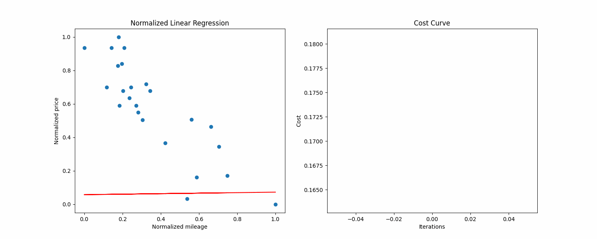
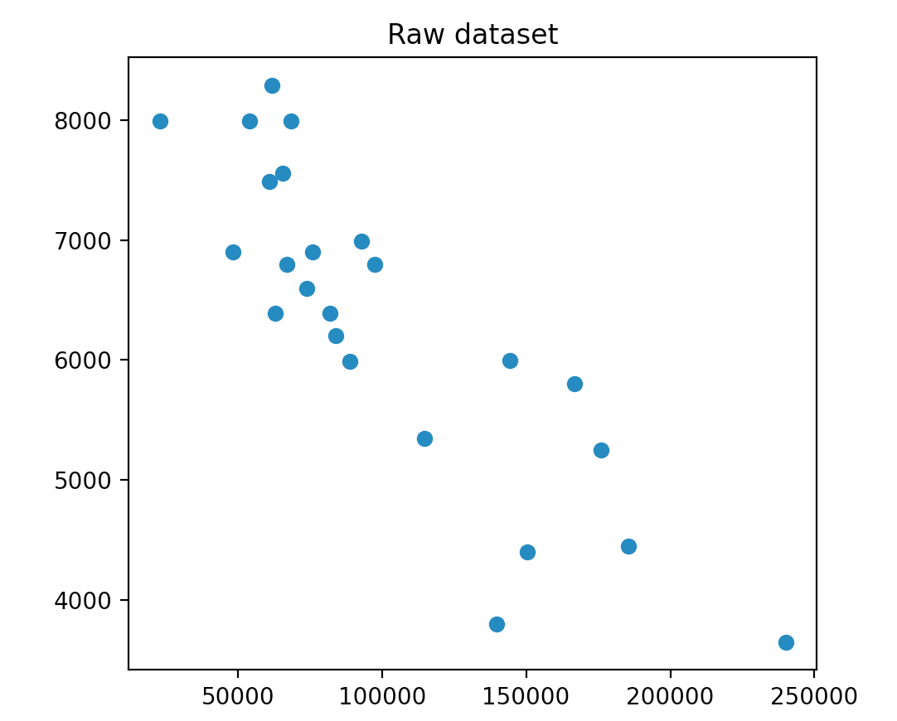
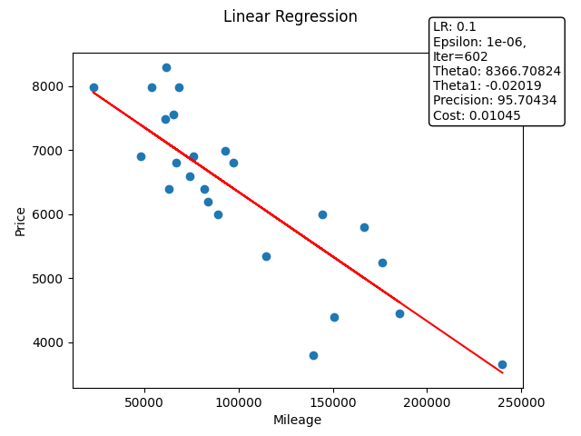
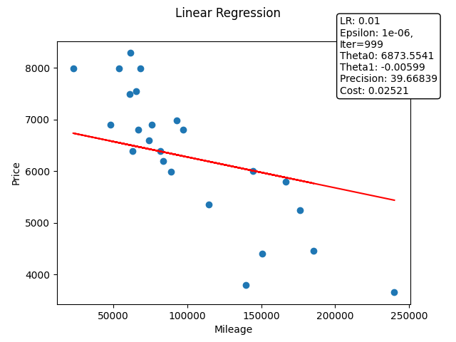
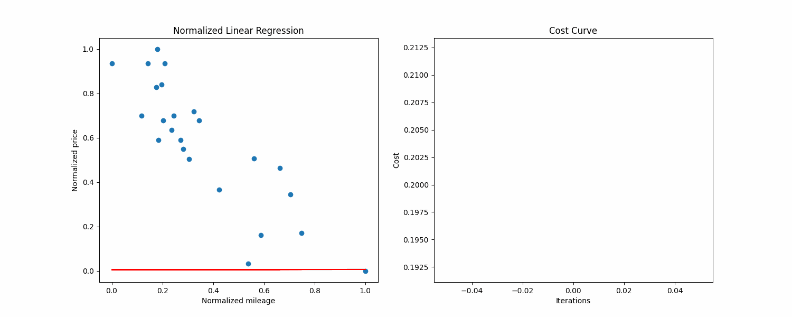

# ft_linear_regression

## Goal of the project

The goal of the project is to train a program to guess the price of a car given its kilometrage. It's a simple linear regression problem.

## How to use ?

Make sure to have a Python >= 3, with os, argparse, logging, numpy, imageio and matplotlib installed.

Make sure you have the file "./data.csv" - or specify your .csv file.

To train the model based on the dataset:

```sh
python3 training.py 
```
#### Arguments are available, see below

```sh
python3 training.py -h

options:
  -h, --help  show this help message and exit
  --f F       Input data file as .csv
  --t0 T0     Initial value for theta0
  --t1 T1     Initial value for theta1
  --lr LR     Learning rate
  --mi MI     Maximum number of iterations
  --ep EP     Convergence threshold for epsilon 
  --gif       Generate GIF of iterations
  --show      Show plots
```
To make a prediction based on the dataset:

```sh
# If the model has already been trained ("./raw_thetas.csv" file should exists)
python3 prediction.py
```
### Makefile
Using the makefile, this will run both scripts with base values:
```sh
make
```

Run both scripts with *training.py* arguments:
##### ***Here I'm setting a target file, learning rate to 0.01, max iterations to 1000,  --gif to create a GIF to help vizualisation, and --show so I can see the differents plots during the process***
```
make ARGS="--f=data.csv --lr=0.01 --mi=1000 --gif --show"
```

Run the training script without params:
```sh
make training
```
Run the prediction script:
```sh
make prediction
```

## Project walkthrough

### What's linear regression ?


*Above is a normalized visualization of the dataset, with the cost curve on the right side.*

Linear regression is the process of finding a line that best fits a given dataset.

In this project, it had to be done with the gradient descent algorithm. You can define "finding the line that best fits M examples" by "**find the line that reduces the average distance between the data points and itself**". Gradient descent is an algorithm that looks at every examples, and adjusts the line a little bit to fit better.

### Get a visual representation of the given dataset

You can use pyplot to visualize data in Python. Here we have a 2D dataset, so we use the scatter function. Here is what we get:

We can see that the axis have a really different scale. In general, machine learning algortihms work best with unskewed data, so what we can do is normalizing our data, to constrain every example between 0 and 1 on both axis. 

We can expect that our theta0 should be around 8000, and our theta1 should be a small negative value. It will help us know if what we'll get is good or not.

### Fit our line

Our line is defined by two parameters, theta0 and theta1:

```
# x = mileage
estimated_price = theta0 + theta1 * x
```

Now we use the gradient descent algorithm to find the best parameters.

Here what's the training looks like on my side, **with 1000 max iterations, a learning rate of 0.1 and epsilon of 1e-6**:


At the end of the training and after converting the values back to the original scale, the *training.py* script gives me this output:

```
Raw theta0: 8366.708243351111, raw theta1: -0.020185129175923234, saved to ./raw_thetas.txt
Plot using raw data saved to ./images/linear_regression.png

Base input file: data.csv
Base values:
    Learning rate: 0.1
    Max iterations: 1000
    Epsilon: 1e-06

Normalized values:
    Normalized theta0: 0.9169157263688892
    Normalized theta1: -0.9444421830220066
    Precision: 95.70434
    Cost: 0.010448846836099734
Iterations: 602
```

### Plot our line and make predictions

We now have our line that minimizes the average distance with examples. We can plot it on our dataset to see if our values seem correct: 

The line seems good, and now we can do predictions by reading on the line, or by using the formula given previously.

## Example using specified values and Makefile arguments
```
make ARGS="--f=data.csv --lr=0.01 --mi=1000 --gif --show"
Welcome to the Linear Regression Car Price Estimator!

Raw thetas file already exists. Do you want to run the program again? (y/n): y
Starting linear regression training...
Gif will be saved to ./images/animation.gif
Gif saved to ./images/animation.gif
Raw theta0: 6873.554104493563, raw theta1: -0.005985084305916514, saved to ./raw_thetas.txt
Plot using raw data saved to ./images/linear_regression.png

Base input file: data.csv
Base values:
    Learning rate: 0.01
    Max iterations: 1000
    Epsilon: 1e-06

Normalized values:
    Normalized theta0: 0.6651943230543922
    Normalized theta1: -0.2800361611850822
    Precision: 39.66839
    Cost: 0.025208990561674628
Iterations: 999
Please enter a mileage...
Enter mileage: 345
Estimated price for 345km: $6871.489
```

As you can see the given outputs are pretty bad, the precision is way too low and the regression line did not converge.
### Example output

